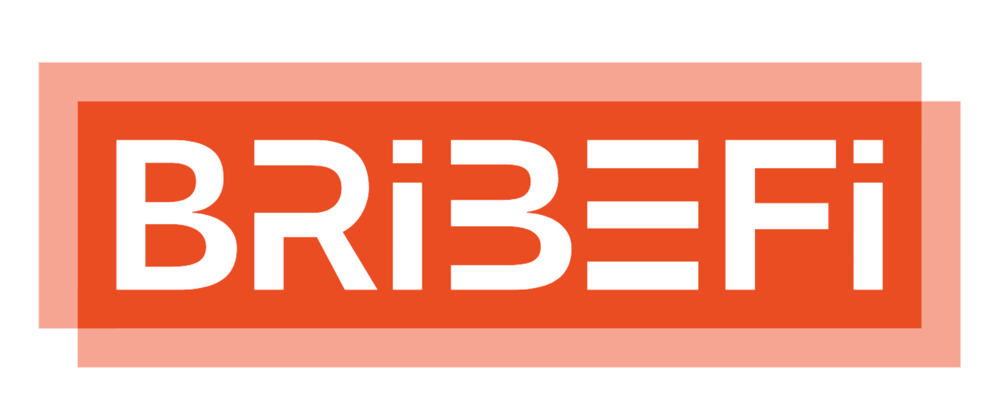

# BribeFI

### Product

BribeFi is Safe multisig module that allows governance participants to bribe holders to make votes on their behalf.

### Motivation

Governance participants want to bribe holders for casting votes. There are already several implementations of governance bribes, for example, Compound DAO.
BribeFi is different in a few ways:

- tokens never leave holder's wallet
- governance participants can buy post-snapshot voting power
- holders receive APY for governance tokens
- auction-based price for the vote



### Overview

BribeFI is a decentralized peer-to-peer platform that enables users to exchange signed data in return for payment. Built for EVM blockchains, the smart contract utilizes the ERC20 token standard and implements the OpenZeppelin Ownable, IERC1271, and IERC20 interfaces.

Users can initiate a signing request by calling the `pushSigningRequest` function with a specified block number, data to be signed, and the amount of payment they are offering. The function verifies that the user has sufficient funds and allowance for the token transfer, then creates a new signing request object with a unique identifier.

The contract owner can review the pending signing requests and accept or reject them by calling the `acceptSigningRequest` or `rejectSigningRequest` function, respectively. If the signing request is accepted, the function verifies the signed data against the original data and pays the offer amount to the counterparty. If the signing request is rejected, the function refunds the offer amount to the counterparty.

The signing request object includes the status of the request, the counterparty's address, the offer amount, the block number, and the data to be signed. The status can be one of Pending, Accepted, or Rejected. The ECDSA library is used for cryptographic signing and verification.

Overall, BribeFI provides a secure and transparent way for users to exchange signed data for payment without the need for intermediaries.

### Environment Variables

The following environment variables are required to deploy the contract:

| Variable            | Description                                            | Example                            |
| ------------------- | ------------------------------------------------------ | ---------------------------------- |
| `PRIVATE_KEY`       | Private key of the account used to deploy the contract | `0x0000...00000`                   |
| `ETHERSCAN_API_KEY` | API key for Etherscan                                  | `JWZYJ8TKAXXXBAAADDDXXXXCCCXXXABC` |
| `RPC_URL`           | RPC URL for the Ethereum network                       | `https://polygon-rpc.com`          |

### Setup

First of all, install the required dependencies:

```shell
yarn install
```

### Compile

Compile the contracts with Hardhat:

```shell
npx hardhat compile
```

### Deploy

Deploy the contracts to Polygon Network:

```shell
npx hardhat deploy --network polygon
```
